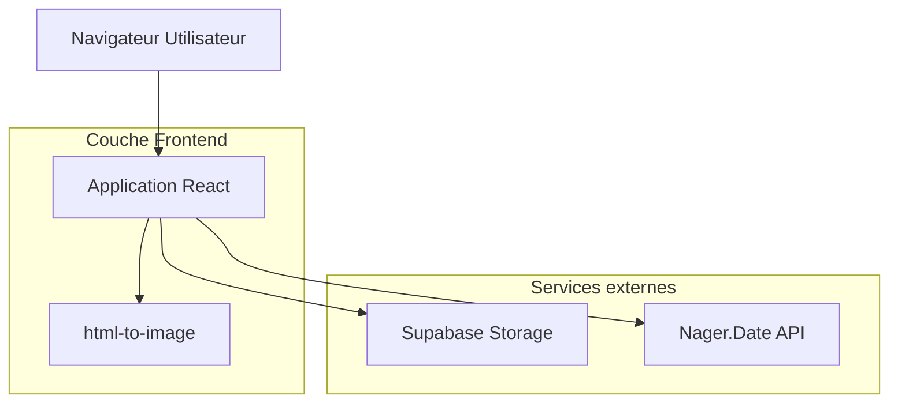

## 1. Architecture du système



## 2. Description des technologies

* **Frontend** : React\@18 + TypeScript + Vite

* **Styling** : Tailwind CSS v4 + shadcn/ui

* **Export** : html-to-image

* **Initialisation** : vite-init ([https://ui.shadcn.com/docs/installation/vite)](https://ui.shadcn.com/docs/installation/vite)

\*- **Backend** : Aucun (architecture frontend-only)

## 3. Définition des routes

| Route       | Objectif                                                   |
| ----------- | ---------------------------------------------------------- |
| /           | Générateur principal, interface de création des wallpapers |
| /preset/:id | Chargement d'un preset sauvegardé (futur)                  |

## 4. Types TypeScript principaux

### 4.1 Types de configuration

```typescript
interface WidgetConfig {
  id: string
  visible: boolean
  colStart: number
  colSpan: number
  rowStart: number
  rowSpan: number
  size: "sm" | "md" | "lg"
  opacity: number
}

interface CalendarConfig {
  month: number
  year: number
  weekStart: "monday" | "sunday"
  titleFormat: "full" | "numeric" | "uppercase" | "abbreviated"
  showWeekends: boolean
  showHolidays: boolean
  accentColor: string
}

interface WallpaperConfig {
  calendar: CalendarConfig
  background: {
    type: "gradient" | "image"
    gradient?: string
    imageUrl?: string
  }
  typography: {
    fontFamily: string
    fontSize: "sm" | "md" | "lg"
  }
  widgets: WidgetConfig[]
}
```

## 5. Structure du projet

```
src/
├── components/
│   ├── Calendar/
│   │   ├── CalendarGrid.tsx
│   │   ├── CalendarHeader.tsx
│   │   └── HolidayIndicator.tsx
│   ├── Widgets/
│   │   ├── SoftwareWidget.tsx
│   │   ├── FolderWidget.tsx
│   │   ├── KeyDatesWidget.tsx
│   │   └── TipWidget.tsx
│   ├── WallpaperCanvas.tsx
│   ├── ControlPanel.tsx
│   └── ExportButton.tsx
├── hooks/
│   ├── useCalendar.ts
│   ├── useHolidays.ts
│   └── useExport.ts
├── utils/
│   ├── dates.ts
│   ├── gradients.ts
│   └── export.ts
├── types/
│   ├── widgets.ts
│   └── calendar.ts
├── data/
│   ├── world-days.json
│   └── font-presets.json
└── pages/
    └── Generator.tsx
```

## 6. Gestion de l'état

Utilisation de Zustand pour la gestion d'état globale :

```typescript
interface WallpaperStore {
  config: WallpaperConfig
  setCalendarConfig: (config: CalendarConfig) => void
  setBackground: (background: BackgroundConfig) => void
  toggleWidget: (widgetId: string) => void
  updateWidgetPosition: (widgetId: string, position: GridPosition) => void
  exportWallpaper: () => Promise<Blob>
}
```

## 7. Services et utilitaires

### 7.1 Service des jours fériés

* Appel à l'API Nager.Date pour les jours fériés français

* Mise en cache locale des résultats

* Format de réponse standardisé

### 7.2 Service d'export

* Utilisation de html-to-image avec configuration optimale

* Rendu 1920×1080 avec qualité maximale

* Gestion des polices et des images

### 7.3 Utilitaires de dates

* Génération du calendrier avec Date et Intl.DateTimeFormat

* Calcul des positions des jours

* Gestion des différents formats de titre

## 8. Préparation Tauri

L'architecture est conçue pour une migration future vers Tauri :

* Logique métier isolée dans des hooks et utilitaires

* State sérialisable en JSON

* Pas de dépendances navigateur-only critiques

* Structure modulaire pour faciliter l'ajout de fonctionnalités desktop

