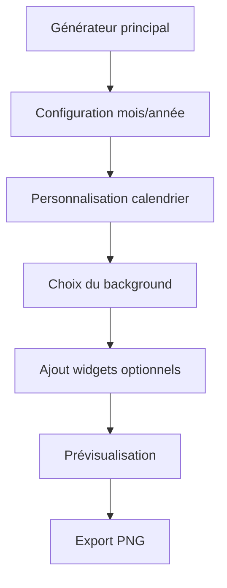

## 1. Vue d'ensemble du produit

PaperMonth est une application web de génération de fonds d'écran mensuels personnalisables. Elle permet de créer des wallpapers desktop (1920×1080) avec un calendrier mensuel et des widgets optionnels.

L'application cible les utilisateurs qui souhaitent personnaliser leur bureau avec des calendriers élégants et fonctionnels, tout en gardant une interface minimaliste et productive.

## 2. Fonctionnalités principales

### 2.1 Rôles utilisateur

| Rôle | Méthode d'inscription | Permissions principales |
|------|----------------------|------------------------|
| Utilisateur | Pas d'inscription requise | Générer et exporter des wallpapers |

### 2.2 Modules fonctionnels

L'application PaperMonth comprend les pages suivantes :
1. **Générateur principal** : interface de création avec aperçu du wallpaper, panneau de configuration et export

### 2.3 Détail des pages

| Nom de page | Module | Description fonctionnelle |
|-------------|---------|---------------------------|
| Générateur principal | Canvas Wallpaper | Afficher le wallpaper en 1920×1080 avec fond et calendrier |
| Générateur principal | Widget Calendrier | Sélectionner mois/année, format du titre, afficher week-ends et jours fériés |
| Générateur principal | Widgets Cards | Ajouter des widgets optionnels (logiciels, dossiers, dates clés, conseils) |
| Générateur principal | Panneau de configuration | Configurer mois, année, début de semaine, typographie, background |
| Générateur principal | Export image | Générer et télécharger le wallpaper en PNG avec qualité maximale |

## 3. Processus principal

**Flux utilisateur principal :**
1. L'utilisateur accède au générateur principal
2. Configure le mois et l'année via le panneau de configuration
3. Personnalise le calendrier (format, début de semaine, couleurs)
4. Choisisse le fond (gradient Tailwind ou image uploadée)
5. Ajoute des widgets optionnels si souhaité
6. Ajuste la typographie et la position des éléments
7. Prévisualise le résultat en temps réel
8. Exporte le wallpaper en PNG (1920×1080)

## 4. Interface utilisateur

### 4.1 Style de design

- **Couleurs primaires** : Palette Tailwind CSS avec accent color personnalisable
- **Style des boutons** : Design shadcn/ui minimaliste avec glassmorphism léger
- **Typographie** : Inter, Poppins, Space Grotesk, Playfair Display
- **Layout** : CSS Grid 12 colonnes pour le positionnement des widgets
- **Icônes** : Style minimaliste et professionnel

### 4.2 Vue d'ensemble des pages

| Nom de page | Module | Éléments UI |
|-------------|---------|-------------|
| Générateur principal | Canvas Wallpaper | Canvas centré 1920×1080, fond gradient ou image, overlay optionnel |
| Générateur principal | Panneau latéral | Configuration organisée en sections collapsibles, contrôles shadcn/ui |
| Générateur principal | Aperçu | Rendu temps réel du wallpaper avec tous les éléments |

### 4.3 Responsive

Approche desktop-first, optimisée pour les écrans larges (1440px+). L'interface s'adapte aux tailles inférieures mais reste centrée sur la création de wallpapers desktop.

### 4.4 Spécifications canvas

- Dimensions fixes : 1920×1080px
- Ratio 16:9 maintenu
- Centré dans la page avec espace pour les contrôles
- Rendu haute qualité pour l'export